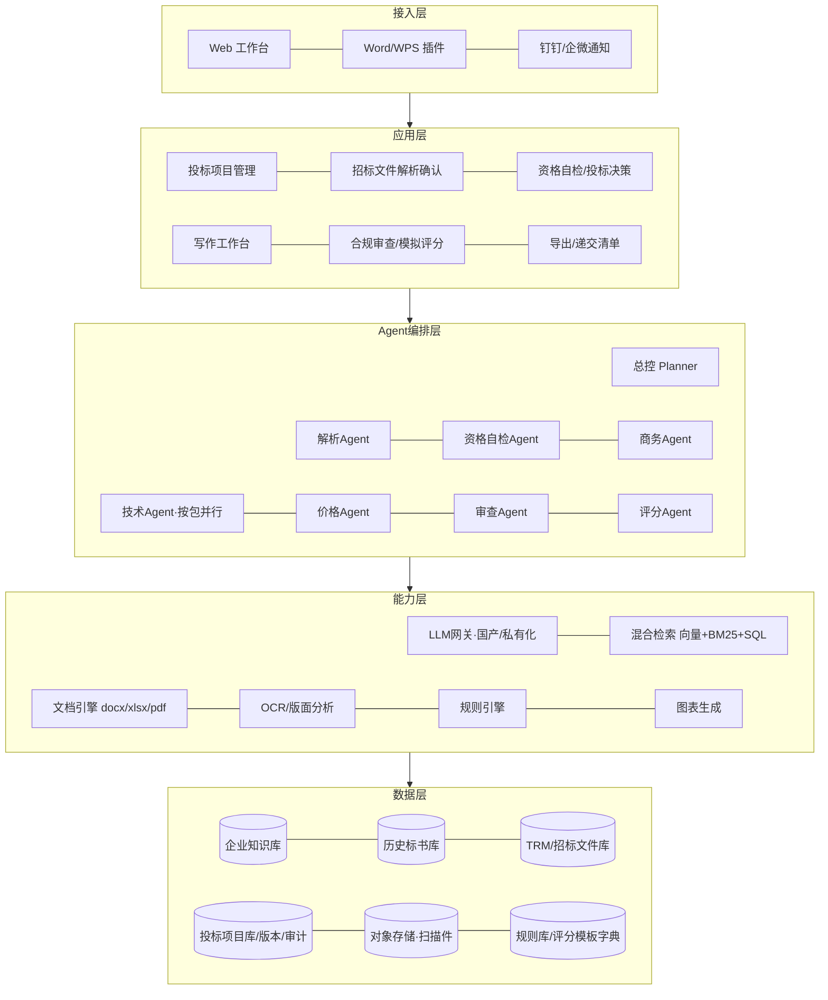

# 国网智能投标 Agent 系统 · 完整技术方案

**开发代号**：金榜（Jinbang）
**版本**：v1.0（调研收尾版）　**日期**：2026-08-21
**定位**：本文是项目总方案，整合了通用方案、国网场景细化、真实招标文件结构分析三份前期文档的全部结论，面向**原型开发**编写。细节出处：
- 《智能写标书Agent技术方案.md》——通用架构与机制原理
- 《国网物资与服务投标-场景细化方案.md》——国网业务规则与否决规则库
- 《国网真实招标文件结构分析.md》——基于本地真实招标文件包的实测结构（解析器/文档引擎的输入输出规范）
- 《参考-国网供应商典型否决案例库（原文摘录）.md》——国网官方否决案例一手材料

---

## 1. 项目概述

### 1.1 一句话定义

面向**国家电网供应商**的智能投标文件编制系统：导入 ECP 下载的招标文件包，自动解析出结构化招标要求，结合企业知识库（资质、业绩、人员、产品、历史标书），由多 Agent 协作生成符合第六章格式、可直接导入投标工具 U+ 的商务/技术/价格文件，并在提交前完成合规审查与模拟评分。

### 1.2 目标（可量化）

| 目标 | 指标 |
|---|---|
| 招标文件解析 | 分标/包/资格/否决/评分/技术参数表抽取准确率 ≥95%，单批次解析 ≤5 分钟 |
| 可投性判断 | 按包输出"可投/有风险/不可投"矩阵，资格比对全自动 |
| 商务文件 | 从建档数据自动组装，人工耗时从 1–2 天降至 ≤1 小时 |
| 技术文件 | 技术参数响应表自动填写 + 技术方案按评分项起草，初稿 ≤4 小时 |
| 防废标 | 否决类问题拦截率 ≥95%（规则库现有 46+22 条真实规则） |
| 模拟评分 | 服务类硬指标评分项（团队/业绩/专利/绩效）预测与实际偏差 ≤5% |

### 1.3 产品定位与合规红线

- **供应商自用工具**：国网明确"投标人应自行编制投标文件，不得委托中介"。系统以私有化部署或专属租户交付给供应商自己的投标团队使用；**绝不**做"代写服务"，多租户形态下禁止同一批次同一包为多家生成文件（串标红线，工具会校验制作机器的 MAC/CPU/硬盘序列号）。
- **事实不生成**：企业名称、资质、业绩、人员、金额等事实只来自结构化库；查不到写【待补充】，导出前强制清零。不良行为、失信信息只做如实披露提示，不提供隐瞒选项。
- **最后一公里留给人**：投标工具 U+ 内的挂载、生成、CA 签章、加密提交由人操作；报价决策由人做，系统只做结构化填充与模拟。

### 1.4 系统边界

```
系统内：解析、建档、检索、起草、填表、组装、审查、模拟评分、导出 docx/pdf/xlsx、递交清单
系统外：ECP 下载招标文件（人）、投标工具 U+ 操作与 CA 签章提交（人）、报价决策（人）、
        造价/凭证单等平台侧生成（人）、终审签字盖章（人）
```

---

## 2. 业务场景要点（已由真实文件验证）

### 2.1 采购组织

国网以**批次**组织招标（总部集招/省公司/直属单位），批次下分**分标**（物资类按物料品类，如"分标051综合网管"），分标下分**包**；服务类按"类别/包"。采购方式：公开招标（资格预审/后审）、竞争性谈判（术语变为应答人/应答文件/开封）、公开谈判、框架协议。全流程电子化：ECP2.0 平台 + 供应商投标工具 U+ + CA 数字证书，本批次样本均不收纸质投标文件，部分批次以"诚信担保"信用承诺替代保证金。

### 2.2 招标文件包物理结构（解析器输入）

```
<批次>_招标文件包.zip                        ← zip 内文件名 GBK 编码（cp437→gbk 转换）
└─ 分标NNN<名>/包N_完整招标文件_<ID>.zip
   ├─ 招标文件(<批次号>).docx                ← 六章主文件
   ├─ 招标公告.zip（第一章docx + 附件xlsx：货物需求一览表/资质业绩一览表，表头在第3行）
   ├─ 包N_技术规范书_<ID>.zip → 按采购申请再嵌套 zip → 技术规范书.docx（一包可多本，
   │    经货物清单"技术规范书ID"逐行关联；ID 前缀 9999=固化规范，其余为项目规范）
   ├─ 合同文件.zip
   ├─ 货物清单_<批次>_<分标>.xlsx            ← 行项目：物资描述/数量/交货/规范书ID
   ├─ 评分细则.zip（服务类样本：价格/商务/技术评分模板 xlsx）
   └─ bidpkgsign*.sign                       ← 签名文件，忽略
```

### 2.3 招标文件六章结构与关键实测规则

| 章 | 内容 | 系统用途 |
|---|---|---|
| 一 | 招标公告 + xlsx 附件（分包、资格业绩要求、最高限价） | 按包资格库 |
| 二 | 投标人须知 + **前附表 77 行**（时间线/有效期90日/报价规则/签章/递交/开标） | 时间线、流程规则 |
| 三 | 评标办法（综合评估法）+ 前附表之一~六（**否决情形 46 行**、价格公式族、评分细则按包引用） | 否决规则库、模拟评分 |
| 四 | 合同条款 | 商务偏差表基准 |
| 五 | 供货要求 → 技术规范书 | 技术参数响应 |
| 六 | 投标文件格式 + **提交方式表 50 行**（每份文件的通道与投标工具上传端口） | 文档模板、递交矩阵 |

必须内置的裁决规则（前附表原文）：商务与技术内容冲突时，**技术参数以技术部分为准；交货期/资格/业绩/质保期以商务部分为准；数量以货物清单为准**。偏差只认偏差表：未写入偏差表的偏离视为未提出。

### 2.4 投标文件构成与制作粒度（实测）

**价格文件按包**（投标工具内填报生成：投标函价格表、货物清单行报价——逐行"未含税单价+税率"，单价不得为零）；**商务文件按分标**（投标函、商务偏差表、基本情况表、执照税务、资格证明+信用查询截图、财务审计、商务评分支撑材料、制造商授权、专用章授权、配合资质能力核实承诺函、法人授权、信用承诺书）；**技术文件按包**（技术偏差表、业绩文件、技术特性参数表、组件配置表、技术评分支撑、售后/质量/产能/装备/工艺/认证/人员/检测报告、制造商授权）；**资质业绩文件走独立通道**（凭证单 zip 原样上传）。

技术规范书三段式：①**标准技术参数表**（序号/参数名称/单位/项目需求值/**投标人保证值**←系统自动填，★项附证明）②项目需求部分 ③**投标人响应部分**（投标人技术偏差表、销售及运行业绩表、测试报告表、鉴定证书表等 7 张表←系统组装）。

投标文件成品形态（真实样本验证）：按第六章目录排布的单个 docx；人员=身份证/学历/职称/资格/社保/劳动合同/服务项目七件套；业绩=标题+合同扫描件+发票扫描件。

### 2.5 投标工具 U+（实机确认）

主界面四通道（商务/价格/**资质业绩**/技术）按标段挂文件；按钮流 `导入 → 编辑 → 生成 → 查看编辑 → 导出查看 → 加密提交 → 撤回`。系统交接面 = "编辑"环节挂载系统产出的文件；"导出查看"导出件可回喂系统做上传前终审。待补：编辑内页表单与 ECP 凭证单页面（不影响原型启动）。

### 2.6 评标规则（实测）

- 综合评估法：商务分 A + 技术分 B + 价格分 C（+其他 D）；分值构成按包由"前附表之三"引用**评分细则模板库**。
- 价格分为公式族（区间平均价浮动法等 ≥5 种）：剔除极值→均值→**基准价=A×(1±c)，c 开标现场随机抽取**→按偏差率扣分（高于/低于基准价惩罚系数 n1/n2 不同）。→ 模拟必须做 c 的区间模拟。
- 低于成本认定触发澄清：< 初评均值 50% 或 < 次低价 50% 或 < 最高限价 45%。
- **同一分标最多中 1 个包**；多包同时第一优先授金额大的包 → 投标组合策略。
- 服务类评分细则模板（官方 xlsx 在手）：商务 FWSW01（诚信-60~0 / 绿色 3 / 科研创新 7 / 综合评价 90）；技术按业务线 18 种模板（JS-FWTY 通用、JS-ZHFW01 科技项目等），评分项多为**可从企业库直接计数的硬指标**（高级职称人数分档、业绩每多 1 项 +2 分、专利每项 +1、国网绩效 ABCDE 分档）。

### 2.7 否决规则库（防废标核心资产）

两个来源已合并：①真实招标文件"否决情形表"46 行（形式/响应性/资格/其他四类）；②国网官方典型案例库 14 类案例反推的 22 条规则（SG-01~SG-22，含系统检查方式与负责 Agent 标注）。要点抽样：技术参数必须填具体数值（禁"完全响应"）、响应值≥要求值、非结构化规范书须附件逐项响应、凭证单 zip 原样上传且分标对应、业绩不认非最终用户、报告有效期覆盖开标日且覆盖包内最严物料、货币单位/税率/小数点三重校验、报价超限（品类 5–10%）、不平衡报价（同规范 ID ±12%）、保证金按包明细表、同法人/控股同包禁投、制造商双代理同包否决、名称与证照不一致否决、串标特征（同机器 MAC/CPU/硬盘）。

---

## 3. 总体架构



设计原则：**招标文件定骨架（六章+提交方式表），企业知识库供血肉（结构化+溯源），评分细则定重点（章节=评分项），规则库守底线（46+22 条），人做决策终审（TRM 确认/报价/定稿）**。Agent 编排用状态机（LangGraph 或自研），每节点可暂停等人、可局部重跑。

---

## 4. 数据模型

### 4.1 TRM（招标要求模型）——解析输出、全流程唯一真源

```json
{
  "batch": {"name":"", "no":"W-2026-SNGW-Z03", "purchaser":"", "agency":"", "method":"公开招标|竞谈|公开谈判", "terminology":"投标|应答"},
  "timeline": {"clarify_deadline":"", "bid_deadline":"", "open_time":"", "validity_days":90, "deposit":{"mode":"none|诚信担保|按包保证金|年度","detail_table_required":true}},
  "sections": [{"chapter":1, "title":"", "source":"docx path", "raw_ref":""}],
  "packages": [{
    "sub_no":"分标051", "sub_name":"综合网管", "pkg_no":"包1",
    "materials":[{"row_id":1,"code":"500009678","desc":"综合网管","qty":1,"unit":"套","deliver_date":"","deliver_place":"","spec_id":"B006-500009678-00011","max_price":null}],
    "qualification":[{"id":"Q1","text":"近三年同类产品合同业绩","evidence":"合同+发票","hard":true,"voucher_ok":null}],
    "spec_docs":[{"spec_id":"","structured":false,"param_table":[{"row":1,"name":"","unit":"","required":"","star":true,"response":null}],"respond_in":"投标工具|附件"}],
    "scoring_ref":{"tech_template":"JS-ZHFW01","biz_template":"FWSW01","price_formula":"区间平均价浮动法","weights":{}}
  }],
  "format": {
    "submission_table":[{"seq":"","item":"","channel":"ECP|辅助系统","port":"价格文件|商务文件|资质业绩文件|技术文件","granularity":"包|分标","template_ref":"第六章格式X","required":true}],
    "file_limits":{"per_pkg_mb":60,"formats":["docx","pdf"],"big_file_channel":true},
    "sign":"整体电子签章"
  },
  "rejection_rules":[{"id":"R1","category":"形式|响应性|资格|其他","text":"","clause":"3.1.2(3)(27)","check":"auto|manual","agent":"price|tech|biz|compliance"}],
  "price_rules":{"per_line":"未含税单价+税率","no_zero":true,"decimal":6,"vat":13,"over_limit_pct":{},"unbalanced_pct":12,"below_cost":{"avg_pct":50,"second_low_pct":50,"cap_pct":45},"benchmark":"公式族参数化","win_limit_per_sub":1},
  "conflict_rules":{"tech_param":"技术部分","delivery_qual_perf":"商务部分","qty":"货物清单"},
  "amendments":[{"date":"","source":"澄清/修改","diff":[], "affected_pkgs":[]}]
}
```

### 4.2 企业知识库（核心表）

```
company_profile   企业主档（名称/信用代码/法人/注册资本/开户行/地址）单条、版本化
certificates      证照（类型/证号/等级/发证机关/有效期/扫描件ID/审核状态）
personnel         人员（姓名/职称/证书/学历/社保单位/劳动合同/可投入状态/七件套扫描件）
performance       业绩（项目/买方及类型[最终用户?]/金额/签约投运时间/物料类别/电压等级/
                  国网内外/合同发票扫描件/发票查验截图）
products          产品（型号/物料类别/参数表[键值对]/适配规范ID列表）
test_reports      检测报告（类型[型式/检测/鉴定]/机构/出具日期/有效期规则/覆盖型号与参数）
sgcc_profile      国网档案（供应商编码/资质能力核实结果及覆盖类别/绩效评价分/不良行为及解除日/凭证单记录）
hq_evidence       高质量发展证据（体系证书/绿电绿证/环评/创新成果/研发团队人数/研发占比/高新/数智化）
ip_assets         标准/专利/论文/科技奖励（级别/第一单位/日期）
boilerplate       话术库（售后承诺/质量措施/服务体系等，审核状态+适用类型）
bid_history       历史标书章节切片（评分项标签/得分/中标结果/脱敏状态）
attachments       对象存储扫描件（OCR 全文/清晰度指标）
```

处理机制：建档（OCR+LLM 抽取→人工确认生效）→ 填充（表格模板变量直填，LLM 不碰事实；正文引用带来源 ID；缺失→【待补充】）→ 维护（有效期 30/60/90 天预警；主档变更触发在投项目资格复核）。

---

## 5. 模块设计

### M1 招标文件解析

输入：招标文件包 zip（含澄清/修改文件增量）。流程：递归解压（GBK 文件名处理）→ 文件分类（主 docx/公告/规范书/清单 xlsx/评分细则/合同/sign 忽略）→ 六章定位（标准章名+样式）→ 分块抽取：前附表与提交方式表按表格结构直读（条款号字典辅助），资格/否决/评分表 LLM+Schema 校验，xlsx 附件按"表头第 3 行"规则读取，技术参数表逐行结构化（★号与样式识别）→ 交叉校验（分值和、时间序、包与规范书 ID 对齐）→ **人工确认页**（对照原文高亮，可改）→ TRM 落库。澄清/修改文件做差异合并并标注受影响包/章节。

### M2 企业知识库（见 4.2）

批量导入向导 + 建档 Checklist（八类材料）+ 有效期看板 + 历史标书自动拆解打标。

### M3 Agent 编排

| Agent | 输入 | 输出 | 要点 |
|---|---|---|---|
| Planner | TRM+企业画像 | 按包写作计划（章节树=第六章目录+评分项映射、素材需求、待人工项、多包差异化策略） | 识别投标组合（同分标限中 1 包） |
| 资格自检 | TRM.qualification+企业库 | 每包可投性矩阵（满足/风险/不满足+证据+补救） | 凭证单/核实结果覆盖、报告有效期推算到开标日 |
| 商务 | TRM+企业库 | 商务文件.docx（按分标）+ 材料页码对照表 + 递交清单项 | 金额大小写、按包保证金明细表、信用查询清单、如实披露 |
| 技术 | TRM+产品库+检索 | 技术文件.docx（按包）：参数表保证值自动填+偏差表+方案章节（对评分项）+报告匹配 | 数值比较含单位换算与≥/≤方向；禁"完全响应"措辞；非结构化规范附件响应；【待补充】机制 |
| 价格 | TRM.price_rules+历史价 | 报价底稿 xlsx+校验报告+价格分区间模拟 | 单位/税率/小数点/超限/不平衡五重校验；c 区间模拟；填报仍在工具内 |
| 审查 | 全部产出+规则库 | 问题清单（否决/扣分/建议 分级）+ 递交矩阵 | 46+22 条规则引擎+LLM 语义项；多包雷同检测；元数据清理；对"导出查看"件做终审比对 |
| 评分 | 产出+评分模板字典 | 预估分+失分热力图+缺证据清单 | 硬指标直接计数（团队/业绩/专利/绩效），软指标多角色 LLM 评审 |

### M4 文档引擎

母版驱动：从第六章与技术规范书 docx 提取模板（保留样式），变量填充+章节装配+扫描件插入（A4 缩放、清晰度检查）→ 输出：商务（分标）/技术（包）docx、报价底稿 xlsx、PDF；60MB 体积预算与图片压缩，超限拆附件卷提示大文件通道；docx 元数据清理；递交矩阵（包×通道×端口 checklist）与投标工具操作清单。

---

## 6. 端到端流程

```
D0  ECP下载招标文件包 → 导入系统 → M1解析 → 人工确认TRM（30分钟）
D0-1 资格自检 → 决策投哪些包（含组合策略）→ 补救待办（报告/核实/凭证单）
D1  Planner计划确认 → 指定人员/产品/报价负责人
D1-4 三线并行起草（商务/技术/价格）→ 补【待补充】→ 澄清文件随时差异合并
D4-6 合规审查+模拟评分 → 按问题清单与失分热力图修改（Word插件闭环）
D7-8 定稿导出 → 人在投标工具U+挂载/生成 → "导出查看"件回喂终审 → CA签章加密提交
开标后 得分/结果/评委意见回写知识库；技术规范响应库沉淀
```

---

## 7. 技术选型

| 层 | 选型 | 说明 |
|---|---|---|
| LLM | 私有化 Qwen 系列 / DeepSeek；API 备选国内合规云 | 长上下文≥128K；投标数据敏感优先私有化 |
| 编排 | LangGraph（状态机、可中断/恢复/局部重跑）| 人机混合流程刚需 |
| 检索 | BGE-M3 + bge-reranker；pgvector 起步→Milvus；ES 关键词 | 事实类查询走 SQL 不走向量 |
| 文档 | python-docx/docxtpl + openpyxl；商用备选 Aspose.Words；LibreOffice headless 转 PDF | 表格保真是生命线 |
| OCR | PaddleOCR + MinerU（PDF 版面） | 扫描件建档与清晰度检测 |
| 后端 | Python FastAPI + Celery + PostgreSQL + Redis + MinIO | 长任务异步 |
| 前端 | React Web 工作台；Office JS/WPS 加载项（P2） | 章节树+审阅批注 |
| 部署 | Docker/K8s 私有化优先 | 多租户需强隔离+同包冲突检测 |

---

## 8. 安全与合规

私有化优先；价格数据默认仅财务与负责人可见；全操作审计与版本历史；导出文件元数据统一清理；不用客户数据训练公共模型；多租户同批次同包冲突检测并拒绝；不良行为/失信只披露不隐瞒；系统留痕支持"自行编制"举证。

---

## 9. 原型（MVP）开发计划

**验证目标**：用本地真实样本（陕西物资 W-2026-SNGW-Z03、江苏服务包147/148、福建竞谈包16——即 `物资/`、`服务/` 目录，作为固定测试集）端到端跑通：导入→解析→确认→资格自检→生成三类文件→审查→导出，产出与真实投标文件成品（已有样本）对比。

**Sprint 划分（2 周/Sprint，共 8–10 周）**

| Sprint | 内容 | 验收 |
|---|---|---|
| S1 | 解析器：嵌套 zip/GBK、文件分类、六章切分、前附表/否决表/提交方式表结构化、xlsx 附件读取、技术参数表逐行抽取；TRM Schema 落库 | 3 套样本解析准确率 ≥90%（对照人工标注） |
| S2 | TRM 确认页（对照原文高亮可改）；企业知识库最小集（主档/证照/人员/业绩/产品/报告）+ 建档导入；资格自检 Agent → 可投性矩阵 | 用测试企业数据出真实可投性报告 |
| S3 | 文档引擎：第六章模板提取+变量填充；商务文件自动组装（按分标）；技术参数表"保证值"自动填写+偏差表；【待补充】机制 | 生成的商务/技术文件与真实成品结构一致，可导入工具（人工验证） |
| S4 | 技术方案章节起草（按评分项+检索+溯源）；价格校验与底稿 xlsx；规则引擎接入否决规则库（先做可自动化的 ~40 条）；递交矩阵 | 对样本人工制造 20 处典型错误，拦截 ≥95% |
| S5 | 模拟评分（服务类硬指标字典+软指标 LLM）；多包雷同检测；元数据清理；PDF 导出；端到端演示与真实项目试点准备 | 完整 Demo：40 分钟内从导入到导出 |

**团队**：后端 2、算法/Prompt 1、前端 1、业务专家 0.5（懂国网投标，负责标注与验收）、测试 0.5。

**原型阶段明确不做**（P2 再做）：Word/WPS 插件、历史标书自动拆解学习、招标信息订阅预筛、工程类暗标、多租户 SaaS、钉钉/企微集成、投标工具编辑内页字段级对接（等实操截图后补）。

---

## 10. 风险与对策（Top5）

| 风险 | 对策 |
|---|---|
| 批次间格式漂移导致解析失灵 | 条款号字典+样式定位双通道；人工确认页兜底；解析规则库随批次积累 |
| 企业资料不全"无米下锅" | 建档 Checklist+缺失预警；【待补充】机制保证不编造 |
| 技术参数自动填写错填 | 产品库参数与报告交叉校验；数值比较引擎单测全覆盖；★项强制人工复核 |
| Word 版式细节不达标 | 母版驱动+真实成品对照测试；商用组件兜底；保留人工微调 |
| 合规质疑（AI 代写） | 自用工具定位+操作留痕；人确认每个关键节点；宣传口径谨慎 |

---

## 附：文档索引

| 文档 | 用途 |
|---|---|
| 本文 | 总方案，开发依据 |
| 智能写标书Agent技术方案.md | 通用机制细节（知识库运营、幻觉防治、Prompt 骨架、通用合规清单） |
| 国网物资与服务投标-场景细化方案.md | 国网规则全集（否决规则库 SG-01~22、TRM 国网扩展、章节模板） |
| 国网真实招标文件结构分析.md | 解析器/文档引擎的输入输出实测规范（含投标工具 U+ 实测） |
| 参考-国网供应商典型否决案例库（原文摘录）.md | 官方否决案例一手材料 |
| 仓库根 物资/、服务/ 目录 | 真实样本 = 原型固定测试集（不入 git） |
