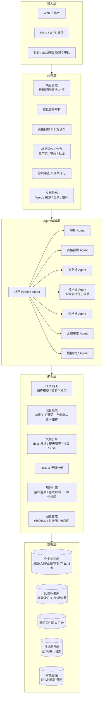
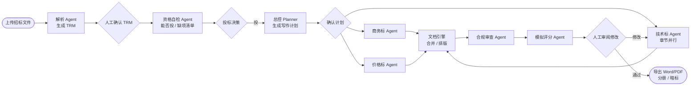

# 智能写标书 Agent 技术方案（v0.1 草案）

> 行业落地篇见《国网物资与服务投标-场景细化方案.md》。
>
> 目标：面向中国企业投标场景，基于甲方（招标人）提供的招标文件/标书模板，结合企业自身的资质、业绩、人员、产品与历史标书等信息，由多 Agent 协作自动生成符合格式要求、可直接进入人工终审的 Word 投标文件（商务标 / 技术标 / 价格标）。

---

## 1. 背景与问题

### 1.1 现状痛点

| 痛点 | 说明 |
|---|---|
| **时间极紧** | 招标文件发出到开标通常 15–20 天（政府采购公开招标不少于 20 日，竞争性磋商/谈判更短），标书专员往往要在 3–7 天内做出几百页文件 |
| **重复劳动多** | 商务标 70% 以上是固定资料（营业执照、资质、业绩、承诺函）反复拼装；技术标大量段落在历史标书中已有 |
| **废标风险高** | 业内统计超 60% 的废标源于可规避的细节：漏签字盖章、格式不符、缺项、★号实质性条款未响应、资质过期、偏离表填错、金额大小写不一致 |
| **质量靠个人** | 标书质量高度依赖少数“老标书”，人员流动即经验流失；技术方案与评分点对不上，该拿的分拿不到 |
| **知识散落** | 证书扫描件、人员证书、合同业绩、产品参数散在各部门/各人电脑，找资料比写资料还费时 |

### 1.2 建设目标

1. **招标文件秒级解析**：自动提取项目概况、时间节点、资格条件、★实质性条款、评分细则、投标文件格式要求、废标条款。
2. **一键判断“能不能投”**：资格条件与企业库自动比对，输出缺项清单。
3. **商务标自动组装**：按甲方格式自动填表、挂证明材料、生成偏离表。
4. **技术标按评分点写作**：每一章节对准评分项，从企业知识库检索素材起草，附来源溯源。
5. **价格标结构化填充 + 报价辅助**：报价表自动生成，价格分公式模拟（不替人决策报价）。
6. **合规审查与模拟评分**：上百条清单式检查 + 模拟专家打分，投标前发现问题。
7. **Word 原生输出**：保留甲方模板样式，自动目录/页码/封面/分册/暗标版，可导 PDF 对接电子标工具。

---

## 2. 业务对象梳理（中国招投标语境）

技术方案必须建立在对标书本身的理解上，本节先把业务对象说清楚。

### 2.1 项目类型

| 维度 | 分类 | 对标书的影响 |
|---|---|---|
| 采购标的 | 工程 / 货物 / 服务 | 工程技术标 = 施工组织设计（常暗标）；货物 = 技术参数逐条响应 + 偏离表；服务 = 实施方案、人员配置、服务承诺 |
| 采购主体 | 政府采购（财政资金）/ 国企招标 / 企业自主采购 | 政府采购有《政府采购法》及 87 号令约束：中小企业声明函、价格分权重下限（货物 ≥30%、服务 ≥10%）等 |
| 采购方式 | 公开招标 / 邀请招标 / 竞争性磋商 / 竞争性谈判 / 询价 / 单一来源 | 竞争性磋商可能多轮报价，投标文件称“响应文件” |
| 载体 | 纸质标 / 电子标 / 纸质+电子 | 电子标需用各地公共资源交易平台的制作工具（生成 GTBS/GEF 等格式）并 CA 签章；系统输出 Word/PDF 供导入 |

### 2.2 招标文件（甲方模板）的典型结构

招标文件本身就是最重要的“模板”。典型章节：

```
第一章  招标公告 / 投标邀请书
第二章  投标人须知（含投标人须知前附表）    ← 时间节点、保证金、装订/份数/密封、电子标要求
第三章  评标办法（含评标办法前附表）        ← 评审因素、分值、评分标准 ★核心
第四章  合同条款及格式
第五章  采购需求 / 技术规范书 / 工程量清单   ← ★号实质性条款、技术参数、服务要求
第六章  投标文件格式                        ← 投标函、开标一览表、授权书、偏离表等固定表格 ★母版
第七章  附件（图纸、清单等）
```

### 2.3 投标文件（我们要生成的）构成

三标常见组织方式：**合订成一册**（中小项目）、**分册**（商务/技术/价格分册）、**分信封**（第一信封商务+技术，第二信封报价，通过初审才拆第二信封）。

**商务标（商务文件 / 资格及商务部分）**

- 封面、目录、投标函及投标函附录
- 法定代表人身份证明、法定代表人授权委托书
- 投标保证金凭证 / 保函
- 资格审查资料：营业执照、资质证书（建筑业企业资质、安全生产许可证、ISO 体系认证、行业许可等）、近三年财务审计报告、纳税证明、社保缴纳证明、信用中国/中国政府采购网查询截图、无重大违法记录声明、中小企业声明函、残疾人福利性单位声明函、监狱企业证明等
- 类似业绩一览表 + 合同/验收证明复印件
- 拟投入项目人员一览表 + 证书/社保/简历
- 商务偏离表、售后服务承诺、履约/质保/廉洁承诺函
- 联合体协议（如有）、其他招标文件要求的资料

**技术标（技术文件）**

- 工程类：施工组织设计（工程概况、施工部署、进度计划、主要施工方案、质量/安全/文明施工/环保措施、资源配置、应急预案、季节性施工、成品保护等）
- 货物类：技术响应/技术规格偏离表（逐条对照★/▲参数）、产品配置清单、技术方案、供货/安装/调试方案、培训、售后
- 服务类：项目理解与需求分析、总体实施方案、组织架构与人员配置、进度计划、质量保障、风险控制、应急预案、验收标准、培训与知识转移、服务承诺
- 通用：项目组织机构图、进度计划（甘特图/横道图）、流程图、拟投入设备表

**价格标（报价文件）**

- 开标一览表、投标报价表（大小写金额）、分项报价表 / 报价明细
- 工程类：已标价工程量清单（通常由造价软件生成，本系统只做校对与嵌入）
- 报价说明、优惠承诺

### 2.4 评标办法

| 方法 | 特征 | 对写作策略的影响 |
|---|---|---|
| 综合评分法（最常见） | 价格分 + 技术分 + 商务分加权，如 30/50/20 | 技术标必须逐项对准评分细则；商务分靠业绩、人员、荣誉“堆材料” |
| 经评审的最低投标价法 | 满足实质性要求前提下价格最低者中标 | 重点是“通过初审、不废标”，技术标写够即可 |
| 性价比法 / 综合评估法 | 类似综合评分 | 同上 |

价格分通常按公式：`价格分 = (基准价 / 投标报价) × 权重分`，基准价 = 最低有效报价或平均报价下浮 X%，需从评标办法中解析出公式用于模拟。

工程项目技术标常要求**暗标**：不得出现企业名称、LOGO、人名及任何可识别标识，字体、页边距、页码格式统一规定 —— 系统需生成“脱敏版”并做敏感信息扫描。

### 2.5 常见废标（无效标）雷区 → 系统必须内建检查

| 类别 | 典型问题 |
|---|---|
| 签字盖章 | 投标函、授权书、报价表未签字/盖章；骑缝章缺失；复印件未盖“与原件一致”章 |
| 格式 | 未按“投标文件格式”章节；擅自改动表格；缺目录/页码；分册装订错误 |
| 缺项 | 漏项、漏附证明材料、投标有效期不足、保证金未按时到账 |
| ★条款 | 实质性条款负偏离或未响应；偏离表漏填 |
| 资质/人员 | 证书过期、人员证书与社保单位不一致、项目经理在建工程超限 |
| 报价 | 大小写不一致、总价与分项不符、超过最高限价、多个报价 |
| 串通/雷同 | 与其他投标人文件雷同、错误一致、同一机器码/IP 制作上传（电子标平台会检测） |
| 时间/名称 | 项目名称、编号、招标人名称写错（复制历史标书未改是重灾区）；日期早于/晚于规定 |

### 2.6 排版与装订要求

字体字号（正文宋体小四 / 仿宋_GB2312 三号等）、行距、页边距、A4、页眉页脚、页码连续、封面格式、正副本份数、胶装/骑缝章、U 盘电子版、PDF 与纸质一致 —— 均需从投标人须知前附表提取为“排版规则”，交给文档引擎执行。

---

## 3. 总体设计思路

> **甲方模板决定“骨架”，企业知识库提供“血肉”，评分办法决定“重点”，合规规则守住“底线”，人负责“决策与终审”。**

1. **不是让大模型自由发挥写标书**，而是把标书专员的工作拆成可执行、可校验的步骤，由不同 Agent 分工完成，事实类内容严格来自企业结构化库。
2. **以招标文件为唯一真源**：所有结构、格式、评分点、时间、名称都从解析后的“招标要求模型（TRM）”读取，避免复制历史标书带来的张冠李戴。
3. **章节 = 评分点**：技术标每一节都对应评分细则里的一条，写作前先明确“这一节要拿哪几分、评委看什么”。
4. **可溯源**：每段生成内容标注来源（哪份历史标书 / 哪条产品资料 / 哪个数据库字段），审阅时可一键跳转。
5. **人机分工清晰**：投/不投、报价、写作计划确认、终稿定稿由人决定；查资料、拼装、起草、排版、检查由 Agent 完成。

---

## 4. 系统架构



分层说明：

- **接入层**：Web 工作台是主入口；Word/WPS 插件用于“在 Word 里改标书时随时调 Agent 续写、检索素材、检查”；钉钉/企微用于任务提醒与审批。
- **应用层**：面向用户的功能模块，围绕“一个投标项目”组织。
- **Agent 编排层**：以状态机方式编排（推荐 LangGraph 或自研），每个 Agent 有明确输入/输出 Schema，可单独重跑。
- **能力层**：模型与工具能力，Agent 通过工具调用（MCP/函数调用）使用。
- **数据层**：企业知识库是核心资产，需要独立的运营流程维护。

---

## 5. 核心模块设计

### 5.1 招标文件解析（Tender Parsing）

**输入**：招标文件（.docx / .doc / .pdf / 扫描 PDF / 图片；电子招标文件先用平台工具另存为 PDF 或 Word）、澄清/答疑/补遗文件（需合并覆盖）。

**输出**：招标要求模型 **TRM（Tender Requirement Model）**，结构化 JSON，示例字段：

```json
{
  "project": {"name": "", "code": "", "purchaser": "", "agency": "", "budget": 0, "max_price": 0, "type": "货物|工程|服务", "method": "公开招标|竞争性磋商|..."},
  "timeline": {"doc_deadline": "", "bid_deadline": "", "open_time": "", "validity_days": 90, "deposit": {"amount": 0, "deadline": "", "form": ""}},
  "qualification": [{"id": "Q1", "text": "具有建筑工程施工总承包二级及以上资质", "evidence": "资质证书扫描件", "hard": true}],
  "substantive_clauses": [{"id": "S1", "mark": "★", "text": "...", "section": "第五章 3.2", "response_required": "逐条响应"}],
  "scoring": {
    "method": "综合评分法",
    "price": {"weight": 30, "formula": "基准价/投标报价×30", "benchmark": "有效最低报价"},
    "items": [{"id": "T1", "category": "技术", "name": "总体实施方案", "score": 10, "criteria": "方案完整、针对性强得8-10分；一般得4-7分；...", "evidence": [], "section_hint": "技术方案第X章"}]
  },
  "bid_doc_format": {
    "volumes": ["商务标", "技术标", "价格标"],
    "toc": [{"vol": "商务标", "title": "投标函", "template_ref": "第六章 格式一", "required": true}],
    "layout": {"font": "宋体", "size": "小四", "margin": "", "page_number": true, "binding": "胶装", "copies": {"orig": 1, "copy": 4}},
    "blind": {"enabled": true, "rules": ["不得出现企业名称、LOGO", "统一宋体小四"]}
  },
  "rejection_rules": ["投标文件未按规定签字盖章", "报价超过最高限价", "..."],
  "deviation_tables": ["商务偏离表", "技术偏离表"],
  "raw_sections": [{"title": "", "path": "", "text": "", "tables": []}]
}
```

**技术路线**：

1. **文档结构化**：docx 用 python-docx / docx4j / Aspose.Words 读取（保留标题层级、表格、样式）；PDF 用 MinerU / pdfplumber 做版面分析；扫描件走 PaddleOCR；表格重点保真（评分表、偏离表、格式表都是表格）。
2. **章节定位**：先按“投标人须知前附表 / 评标办法前附表 / 投标文件格式”等标准章名和正则定位候选章节，缩小 LLM 处理范围。
3. **LLM 抽取**：分块（按章节）调用模型，按 JSON Schema 输出，做 Schema 校验与二次校验（如分值之和是否等于总分、时间先后关系是否合理）。
4. **★/▲/加粗条款识别**：结合 docx 样式（加粗、特殊符号）+ 语义判断，防漏。
5. **人工确认页**：解析结果以“对照原文高亮”方式呈现，用户确认/修正后落库（这一步是后续一切工作的基础，必须允许人改）。
6. **答疑/补遗合并**：新文件解析后与原 TRM 做差异合并，标注变更点并通知已在写作的章节。

### 5.2 企业知识库（Enterprise Knowledge Base）

这是系统能否“结合企业自身信息”写标书的关键，也是最需要运营投入的部分。

**数据分类与形态**

| 类别 | 内容 | 形态 | 关键属性 |
|---|---|---|---|
| 企业基本信息 | 名称、统一社会信用代码、法人、注册资本、地址、开户行、联系人 | 结构化 | 版本、生效日期 |
| 资质证书 | 营业执照、资质证书、安全生产许可证、ISO 体系、行业许可、软著/专利、荣誉、信用等级 | 结构化 + 扫描件 | **有效期**、等级、发证机关、适用范围 |
| 人员库 | 姓名、职称、职务、注册证书（建造师/造价师/PMP/高项等）、社保、学历、简历、在建项目 | 结构化 + 扫描件 | 证书有效期、社保单位一致性、是否可投入 |
| 业绩库 | 项目名称、甲方、合同金额、签约/验收时间、内容摘要、合同/验收/中标通知书扫描件 | 结构化 + 扫描件 | 行业标签、金额区间、“类似业绩”关键词 |
| 财务/税务 | 近三年审计报告、纳税证明、社保证明、银行资信 | 扫描件 | 年度 |
| 产品/技术素材库 | 产品参数表、技术白皮书、架构图、检测报告、方案段落 | 半结构化 + 文本 | 产品线、版本、适用行业 |
| 历史标书库 | 已投标书按**章节切片**存储 | 文本 + 元数据 | 项目类型、评分点标签、当年得分/中标与否、撰写人 |
| 标准话术库 | 售后服务承诺、培训方案、应急预案、质量保证措施、廉洁承诺等模板段落 | 文本 | 适用类型、审核状态 |
| 竞争与市场 | 竞争对手中标价、历史中标价、行业价格区间 | 结构化 | 时间、区域 |

**存储方案**

- 结构化数据：PostgreSQL（含 pgvector）或 MySQL + Milvus
- 文本切片向量索引：Milvus / pgvector，Embedding 推荐 BGE-M3（中文效果好、支持长文本），重排 bge-reranker
- 关键词索引：Elasticsearch（业绩名称、产品型号等精确匹配依赖关键词）
- 扫描件/图片：对象存储（MinIO / OSS），带 OCR 文本以便检索

**入库与运营流程**

1. 批量导入（Excel/文件夹）→ 自动解析（OCR + LLM 抽取字段）→ 人工审核 → 打标签 → 生效
2. **有效期预警**：证书、人员证书、审计报告到期前提醒
3. **历史标书自动拆解**：上传旧标书 → 按章节切片 → LLM 打评分点标签、抽取“可复用段落” → 去除项目专属信息（甲方名、项目名）形成“方案原子”
4. **中标复盘回写**：记录得分、评委意见，作为素材质量权重

**检索策略**

- 混合检索：向量语义 + BM25 关键词 + 结构化过滤（行业、金额、时间、有效期内）→ 重排 → 取 Top-K
- 事实类问题（“我们有几个一级建造师”）直接走 SQL / 结构化查询，不走向量
- 检索结果带来源 ID，供写作 Agent 引用与溯源

#### 5.2.1 公司信息的处理机制（建档 → 存储 → 填充 → 维护）

公司信息是标书里出现频率最高、也最不允许出错的内容（名称写错即废标）。系统的处理原则是：**提前建档的结构化数据 + 扫描件，写标书时是"填充"而不是"生成"**——模型只负责组织语言，事实一律来自库。

**（1）一次性建档（上线时做，之后只维护增量）**

| 来源 | 内容 | 方式 |
|---|---|---|
| 证照扫描件 | 营业执照、资质证书、体系认证、试验/检测报告、审计报告等 | 批量上传 → OCR + LLM 抽取字段（名称、证号、发证机关、有效期）→ **人工确认后生效** |
| 公开数据回填 | 国家企业信用信息公示系统、信用中国 | 按统一社会信用代码抓取工商信息、行政处罚，与自报信息交叉核对 |
| 人工录入 | 开户行账号、联系人、法定代表人身份证信息、人员社保、业绩明细 | 表单录入，指定专人负责 |

每条信息 = **结构化字段 + 原始扫描件 + 有效期 + 审核状态**，四者绑定。"营业执照"不是一张图片，而是一条记录：`{名称, 统一社会信用代码, 法定代表人, 注册资本, 成立日期, 住所, 有效期, 扫描件文件, 最后核对日期}`。

**（2）存储模型**

```
company_profile   企业主档（名称/代码/法人/注册资本/地址/开户行…）→ 单条、版本化
certificates      证照表（类型/证号/等级/发证机关/有效期/扫描件ID）
personnel         人员表（姓名/证书/社保单位/在建项目）
performance       业绩表（买方类型/金额/时间/类别/证明材料ID）
attachments       对象存储扫描件，带 OCR 全文
```

**（3）写标书时的填充规则**

- **模板变量直填**：投标函、授权书、开标一览表等表格，模板空位映射为变量（`{{company.name}}`、`{{company.credit_code}}`、`{{legal_person.name}}`、`{{bank.account}}`…），由文档引擎从企业主档直接取值填充，**LLM 不参与**，杜绝抄错。
- **正文引用带溯源**：技术方案里涉及公司事实的句子（"我公司拥有一级建造师 X 名"），写作 Agent 只能引用检索到的结构化数据并带来源 ID；查不到就输出 `【待补充：xxx】`，导出前强制清零。
- **扫描件按需插入**：按资格条件/评分项自动挑选对应证照附件插入，并生成"证书 ↔ 页码"对照表。
- **全文一致性校验**：公司名称（全称/简称）、统一社会信用代码、法人姓名跨章节比对，防止复制历史标书带入其他公司信息。

**（4）维护机制**

- 证照/报告/审计到期前 30/60/90 天分级预警（国网场景：型式试验报告有效期须覆盖开标当日）。
- 企业主档变更（法人、地址、合并分立）→ 触发"在投项目资格复核"待办（对应国网否决规则 SG-09）。
- 每次投标后记录"最近使用于 XX 项目"；长期未使用、未核对的字段提示复核。

**（5）初次建档材料清单（企业照单交材料的 Checklist）**

| 类别 | 需要提供 | 形式 |
|---|---|---|
| 工商 | 营业执照、开户许可证/基本存款账户信息、章程（如需） | 扫描件 |
| 法人与授权 | 法定代表人身份证、常用被授权人身份证及联系方式 | 扫描件 + 表单 |
| 资质认证 | 各类资质证书、ISO 体系证书、行业许可、高新/软著/专利 | 扫描件 |
| 财务税务 | 近三年审计报告、纳税证明、社保缴纳证明 | 扫描件 |
| 人员 | 名册（姓名/职称/证书/社保单位）、关键人员证书与简历 | Excel + 扫描件 |
| 业绩 | 业绩台账（项目/买方/金额/时间/类别）、合同关键页、验收/中标通知书、发票 | Excel + 扫描件 |
| 产品（物资类） | 型号参数表、型式试验/检测报告、产品说明书 | 文档 + 扫描件 |
| 常用文本 | 售后承诺、质保承诺等既有话术、近 2 年历史标书 | Word/PDF |

建档工作量约 1–2 周（专人），此后每次投标为纯复用；这也是第 9 节要求企业侧指定"知识库运营"角色的原因。

### 5.3 Agent 编排设计

采用“总控 + 专职 Agent”模式，状态机驱动，每个节点可暂停等待人工确认、可单独重跑。



**总控 Planner Agent**

- 输入：TRM、企业画像
- 输出：写作计划 —— 章节树（严格按“投标文件格式”章节 + 评分点补充），每个章节：目标分值、评审标准、需要检索的知识类别、写作策略（如“突出 3 个同类业绩”、“逐条响应★参数”）、预估篇幅、负责 Agent、是否需人工输入
- 识别“需要人提供的信息”（如本项目拟派项目经理、报价、特殊承诺）生成待办

**资格自检 Agent**

- 将 TRM.qualification 逐条与企业库比对：满足 / 不满足 / 需人工判断，附证据（证书 ID、有效期）
- 输出“投标可行性报告”，包括缺项、可补救方式（联合体、临时办理）

**商务标 Agent**

- 表单填充：投标函、法人身份证明、授权书、开标一览表等——从 TRM 与企业库字段自动填充，金额自动大小写，日期按规定
- 材料组装：按资格条件与评分项挑选证书/业绩/人员扫描件，按顺序插入并生成“材料目录”
- 业绩筛选：按招标文件“类似业绩”定义（时间范围、金额、行业）自动筛选并排序，标注每条对应的评分项
- 偏离表：商务偏离表按合同条款逐条“无偏离/正偏离/负偏离”生成，负偏离标红要求人工确认
- 承诺函/声明函：从话术库取模板，替换项目信息

**技术标 Agent（多章节并行子写手）**

每章节的写作循环：

1. 读取该章节的评分点、评审标准、★条款
2. 检索：历史标书同类章节 + 产品资料 + 话术库，带过滤（同行业、近三年、得分高）
3. 生成大纲 → 逐节起草（控制篇幅与格式：标题层级、表格、图示位置占位）
4. 自评：对照评审标准打分、检查★条款是否逐条正面响应、是否出现项目/甲方名称错误、是否含暗标禁词
5. 输出：docx 片段（结构化 Markdown/中间格式）+ 溯源标注 + 待人工补充点（如“需填写现场勘察情况”）

要点：
- **逐条响应**：货物类技术参数、★条款生成“招标要求 / 投标响应 / 偏离说明 / 证明材料页码”四列表格
- **图表**：组织架构图、进度甘特图、流程图由图表生成能力（Mermaid/Graphviz/PlantUML → 图片）生成后插入
- **风格一致**：全篇统一术语表（项目名、甲方名、产品名）注入 Prompt
- **不得编造事实**：涉及数字（人数、年限、案例）必须来自结构化库检索结果，无来源则留“【待补充】”标记而不是编

**价格标 Agent**

- 报价表结构填充：按招标文件报价表格式生成，分项自动汇总，大小写校验，与开标一览表一致
- 报价辅助（决策由人）：解析价格分公式 → 输入若干假设报价 → 模拟价格分；关联历史中标价、最高限价、成本底线；提示“低于成本价”“超限价”风险
- 工程类：已标价工程量清单由造价软件生成，本系统读取 Excel 做一致性校验后嵌入

**合规审查 Agent（Reviewer）**

清单式检查（规则引擎 + LLM 语义判断），输出问题列表（等级：废标 / 扣分 / 建议）：

- 完整性：TRM.bid_doc_format.toc 每项是否存在；证明材料是否齐全
- 签章位：所有需签字盖章处生成“签章提示页/清单”，导出时插入签章标记
- ★条款：逐条是否正面响应
- 一致性：项目名称、编号、招标人、投标人名称、日期、报价（大小写、总分项、开标一览表 vs 报价表）、工期/服务期、投标有效期
- 格式：字体字号、页码、目录、页边距、分册结构、封面要素
- 有效期：证书、人员证书、审计报告是否在有效期内
- 暗标：脱敏扫描（企业名、简称、LOGO、人名、电话、地址、水印、文档属性作者字段）
- 雷同风险：与本企业历史标书高度雷同段落提示（避免多家共用模板导致的雷同）；文档元数据清理
- 敏感/禁用词：招标文件中禁止出现的表述

**模拟评分 Agent**

- 按 TRM.scoring 逐项以“评标专家”角色打分，给出得分区间、失分原因、改进建议
- 多角色（技术专家、商务专家、挑剔型专家）独立打分取汇总，降低单次评分偏差
- 输出“预估总分与失分热力图”，指导重点返工

### 5.4 文档生成与排版引擎（Word）

标书就是 Word，这个模块决定成果能否“直接用”。

**设计原则**：以招标文件“投标文件格式”章节为母版，Agent 产出内容，引擎负责排版；LLM 不直接产 docx。

**能力清单**

1. **模板驱动填充**：从招标文件 docx 中提取格式章节的表格/段落作为模板（保留原样式），用字段填充（docxtpl / python-docx / Open XML SDK；商用可选 Aspose.Words 稳定性更好）
2. **章节装配**：按章节树把各 Agent 输出的中间格式（结构化 Markdown / JSON 块）渲染为 docx，应用排版规则（标题样式、正文字体字号、行距、表格样式）
3. **自动化元素**：封面（项目名/编号/投标人/日期）、目录（域自动更新）、页眉页脚、页码（分册各自起始）、图片（证书扫描件按 A4 缩放）、金额大小写、“与原件一致”标注页
4. **多版本输出**：合订本 / 分册（商务、技术、价格）/ 正本副本 / 暗标脱敏版 / 电子版 PDF（LibreOffice headless 或 Word COM 转换）
5. **签章清单**：导出“需签字盖章位置清单”，与 PDF 页码对应
6. **电子标对接**：输出满足平台工具导入要求的 Word/PDF（各地工具要求不同：有的要按章节分别导入、有的限制文件大小、有的要求 PDF 版本），CA 签章与生成 GTBS 等步骤仍由人在平台工具中完成
7. **Word/WPS 插件**：在 Word 内选中段落 → 调用“按评分点改写 / 检索素材 / 检查本节”，修改回写系统保持版本一致

### 5.5 质量控制与幻觉防治

| 措施 | 说明 |
|---|---|
| 事实字段白名单 | 企业名、资质、人员、业绩、金额、日期只允许来自结构化库或 TRM，Prompt 层禁止生成，输出层正则校验 |
| 溯源标注 | 每段落记录来源（知识库 ID / 历史标书章节 ID），审阅界面可点击查看原文 |
| 待补充标记 | 检索不到依据时输出【待补充：xxx】而不是编造，导出前强制清零 |
| 一致性校验 | 术语表、数字、日期、名称跨章节比对 |
| 项目专属信息替换 | 复用历史内容时对甲方名/项目名/地名做实体识别与替换检查 |
| 双模型交叉审 | 写作与审查用不同模型或不同 Prompt 角色，降低同源盲区 |
| 人工终审 | 关键节点强制人工确认；系统提供“变化对比”与“问题清单”降低审阅成本 |

---

## 6. 端到端流程（以 20 天投标周期为例）

| 阶段 | 天数 | 参与者 | 系统动作 | 人工动作 |
|---|---|---|---|---|
| 1. 立项 | D0 | 商务 | 创建投标项目、上传招标文件 | — |
| 2. 解析 | D0 | 解析 Agent | 生成 TRM、时间提醒（保证金、答疑、截止） | 对照原文确认/修正 TRM（30 分钟） |
| 3. 资格自检 | D0–D1 | 资格 Agent | 比对企业库，输出缺项 | 决策投/不投；补办材料 |
| 4. 计划 | D1 | Planner | 生成章节树与写作计划、待办（人员、报价、承诺） | 确认计划、指定项目经理等人工输入 |
| 5. 起草 | D1–D3 | 商务/技术/价格 Agent | 并行生成初稿、组装材料、生成图表 | 补充【待补充】项 |
| 6. 审查 | D3 | 审查/评分 Agent | 问题清单、模拟评分、失分热力图 | 按问题清单修改（Word 插件） |
| 7. 迭代 | D3–D7 | — | 重跑局部章节、增量审查 | 报价决策、领导审批 |
| 8. 答疑合并 | 随时 | 解析 Agent | 补遗文件差异合并，标注受影响章节 | 确认 |
| 9. 定稿导出 | D7–D8 | 文档引擎 | 分册/暗标/PDF、签章清单、终审报告 | 打印、签章、装订 / 平台工具制作电子标 |
| 10. 复盘 | 开标后 | 系统 | 记录得分、中标结果回写知识库 | 填写评委意见 |

---

## 7. 技术选型建议

| 层 | 选型 | 说明 |
|---|---|---|
| 大模型 | 国产为主：DeepSeek / 通义千问 Qwen / 智谱 GLM / 文心 / Kimi；私有化可部署 Qwen 开源系列 | 标书含报价与商业机密，优先私有化或国内合规云；长上下文（≥128K）便于整章解析 |
| Agent 框架 | LangGraph（状态机、可中断恢复）或自研编排；工具协议采用 MCP / Function Calling | 需要“暂停等人确认再继续”和“局部重跑” |
| Embedding / 重排 | BGE-M3 + bge-reranker-v2-m3 | 中文效果、可私有化 |
| 向量/检索 | pgvector（起步）→ Milvus（规模化）；Elasticsearch 做关键词 | 混合检索 |
| 文档解析 | python-docx / docx4j、MinerU、pdfplumber、PaddleOCR | 表格保真是重点 |
| 文档生成 | python-docx + docxtpl（开源）或 Aspose.Words（商用，样式/目录/域更稳） | 输出 Word；LibreOffice headless 转 PDF |
| 图表 | Mermaid / PlantUML / Graphviz → PNG | 组织架构、甘特图、流程图 |
| 后端 | Python（FastAPI）+ Celery/任务队列；或 Java Spring Boot + Python 算法服务 | 长任务异步 |
| 前端 | React/Vue Web 工作台；Office JS / WPS 加载项 | 章节树 + 富文本审阅 + 批注 |
| 存储 | PostgreSQL、Redis、MinIO/OSS | — |
| 部署 | 私有化（Docker/K8s）优先；SaaS 需多租户强隔离 | 见第 8 节 |

---

## 8. 数据安全与合规

1. **部署形态**：报价、成本、业绩合同属高度敏感，推荐私有化或专属 VPC；SaaS 模式需租户级加密隔离，报价类数据可本地加密后再上云或不上云。
2. **模型调用**：私有化模型或国内合规 API；调用日志脱敏；禁止用客户数据训练公共模型。
3. **权限**：按项目/角色（商务、技术、财务、领导）分权，价格标默认仅财务与负责人可见。
4. **审计**：全流程操作日志、版本历史、导出记录，可追溯谁改了什么。
5. **反串标合规**：《招标投标法》禁止串通投标。系统**必须**避免为同一项目的多家投标人生成文件（多租户场景做同项目冲突检测并拒绝）；导出文件清理作者、公司、机器等元数据；提示用户不同投标人不得在同一设备/IP 制作上传。
6. **文档元数据**：docx 属性（作者、公司、最后修改者、修订记录）统一清理，暗标尤为重要。
7. **知识产权**：历史标书、产品资料的使用授权归企业自身；外部素材需标明来源。

---

## 9. 实施路线

| 阶段 | 周期 | 范围 | 里程碑 |
|---|---|---|---|
| **P1 MVP** | 6–8 周 | 招标文件解析（docx/pdf）+ TRM 确认页；企业知识库基础（企业信息、资质、人员、业绩、话术）；资格自检；商务标自动组装；技术标章节起草（服务类/货物类）；合规检查清单（核心 50 条）；Word 导出（合订本） | 用 3–5 个真实项目跑通端到端，初稿生成 ≤ 1 小时 |
| **P2 提效** | +8 周 | 历史标书自动拆解与学习；模拟评分；图表生成；分册/暗标/PDF；Word 插件；答疑合并；工程类施工组织设计模板；价格分模拟 | 首稿修改量下降 50%，废标类问题拦截率 ≥ 95% |
| **P3 智能化** | +12 周 | 报价辅助（历史中标价、竞争对手）；招标信息订阅与自动预筛（能不能投）；多行业模板库；中标复盘与素材质量权重；多租户 SaaS（如需） | 从“写标书工具”走向“投标全流程助手” |

**团队建议（P1）**：产品/业务专家 1（懂标书）、后端 2、算法/Prompt 1、前端 1、测试 1；企业侧需指定“知识库运营”负责初始资料整理。

---

## 10. 效果指标（KPI）

| 指标 | 现状（典型） | 目标 |
|---|---|---|
| 招标文件解析准确率（资格/★条款/评分项） | 人工 2–4 小时 | ≥ 95%，5 分钟内 |
| 商务标组装时间 | 1–2 天 | ≤ 1 小时 |
| 技术标初稿时间 | 3–5 天 | ≤ 4 小时 |
| 废标类问题拦截率 | 依赖人工 | ≥ 95% |
| 初稿到定稿人工修改比例 | — | ≤ 30% 段落 |
| 技术标模拟得分 vs 实际得分偏差 | — | ≤ 10% |
| 知识库资料复用率 | — | ≥ 70% 段落有来源 |

---

## 11. 风险与对策

| 风险 | 对策 |
|---|---|
| 招标文件格式千差万别，解析漏项 | 标准章名定位 + LLM 抽取 + 人工确认页；持续积累解析规则库；答疑合并机制 |
| 企业资料不全、质量差，Agent“无米下锅” | 上线前资料整理服务；【待补充】机制；有效期与缺失预警 |
| 模型幻觉编造业绩/参数 | 事实白名单、溯源、待补充标记、双模型审查、人工终审 |
| 内容与其他公司雷同（都用同一 AI 工具） | 强依赖企业自身素材、历史标书；风格个性化；雷同检测 |
| Word 排版细节难以完美复刻甲方格式 | 母版驱动 + 商用文档组件（Aspose）；保留人工微调；Word 插件闭环 |
| 电子标平台工具各异 | 输出标准 Word/PDF，明确“最后一公里”由人在平台工具操作；逐步积累各地平台要求 |
| 数据安全顾虑阻碍采用 | 私有化部署选项、权限与审计、不训练公共模型承诺 |
| 反串标合规风险 | 同项目冲突检测、元数据清理、使用规范提示 |

---

## 12. 附录

### 12.1 技术标章节写作 Prompt 骨架

```
你是投标文件技术标撰写专家。请为【{项目名称}】投标文件撰写章节《{章节标题}》。

【招标要求】
- 评分项：{评分项名称}（{分值}分）
- 评审标准：{评审标准原文}
- 需响应的★条款：{条款列表}
- 采购需求相关原文：{需求摘录}

【企业素材（仅可使用以下素材中的事实，禁止编造数字/案例/证书）】
{检索到的素材，每条带 [来源:ID]}

【写作要求】
- 结构：{大纲}；篇幅约 {字数}
- 术语统一：{术语表}
- 逐条正面响应★条款，使用“完全响应”表述并说明如何满足
- 涉及企业事实的句子在句末标注 [来源:ID]；无素材支撑的信息写【待补充：说明需要什么】
- 不出现其他项目/甲方名称；{暗标要求：不得出现企业名称等}
- 输出格式：结构化 Markdown（##/###/表格），不写与评分无关的套话
```

### 12.2 合规检查清单（节选）

| 编号 | 检查项 | 等级 | 数据来源 |
|---|---|---|---|
| C01 | 投标函是否按格式、是否有法定代表人/授权人签字与公章位 | 废标 | TRM.bid_doc_format + 文档 |
| C02 | 授权委托书是否附身份证复印件、有效期是否覆盖投标有效期 | 废标 | 文档 + 企业库 |
| C03 | 投标有效期 ≥ 招标要求 | 废标 | TRM.timeline |
| C04 | 报价大小写一致、开标一览表 = 报价表合计、≤ 最高限价 | 废标 | 价格标 |
| C05 | ★条款逐条正面响应，无负偏离 | 废标 | 技术偏离表 |
| C06 | 资格条件对应证明材料齐全且在有效期内 | 废标 | 企业库 |
| C07 | 项目名称/编号/招标人名称全文一致且与招标文件相同 | 废标 | 全文 |
| C08 | 拟派项目经理证书、社保单位与投标人一致 | 废标/扣分 | 人员库 |
| C09 | 每个评分项都有对应章节/材料 | 扣分 | TRM.scoring |
| C10 | 类似业绩满足时间/金额/行业定义并附合同关键页 | 扣分 | 业绩库 |
| C11 | 字体、字号、页码、目录符合前附表要求 | 扣分/废标 | 排版规则 |
| C12 | 暗标版无企业名称/LOGO/人名/元数据 | 废标 | 脱敏扫描 |
| C13 | 文档属性作者/公司/修订记录已清理 | 建议 | docx 元数据 |
| C14 | 无【待补充】残留 | 阻断导出 | 全文 |

### 12.3 参考资料

- 投标文件组成与三标结构：[华律网](https://m.66law.cn/laws/370032.aspx)、[招标文件与应标文件的深度解析](https://www.cnblogs.com/BlogNetSpace/p/18815025)、[投标文件制作全流程](https://zhuanlan.zhihu.com/p/18235615918)
- 综合评分法与价格分权重：[深圳市财政局：什么是综合评分法](http://szfb.sz.gov.cn/zxbs/ywgz_3_1/sfjdl_3/content/post_10214112.html)、[综合评分法中评审因素设置的原则及应用](http://www.cgpnews.cn/articles/67798)、[评标办法前附表示例](https://jtw.beijing.gov.cn/xxgk/ztbxx/202203/P020220303639791049617.pdf)
- 常见废标原因：[10大类常见废标原因总结](https://zhuanlan.zhihu.com/p/21411946657)、[标书里的“废标雷区”](https://blog.csdn.net/aihuijutang/article/details/144317894)、[信邦标书：废标原因与避坑指南](https://www.sohu.com/a/1023026235_122579914)
- 电子标制作与 CA 签章：[电子标书怎么制作](https://zhuanlan.zhihu.com/p/412982908)、[北京市公共资源交易中心电子投标书编制工具使用手册](https://ggzyfw.beijing.gov.cn/cmsbj/u/cms/cn.gov.bjggzyfw.www/202310/16111003nywl.pdf)、[南京市电子标书制作步骤](https://www.nanjing.gov.cn/zt/njsggzyjywkd/xyf/202307/t20230705_3954314.html)
- 市场上 AI 标书产品参考：[2025 年 AI 写标书软件评测](https://zhuanlan.zhihu.com/p/1961817266443223690)、[快标书 AI](https://www.kuaibiaoshu.com/)、[IT之家：AI 标书软件体验](https://www.ithome.com/0/971/847.htm)
